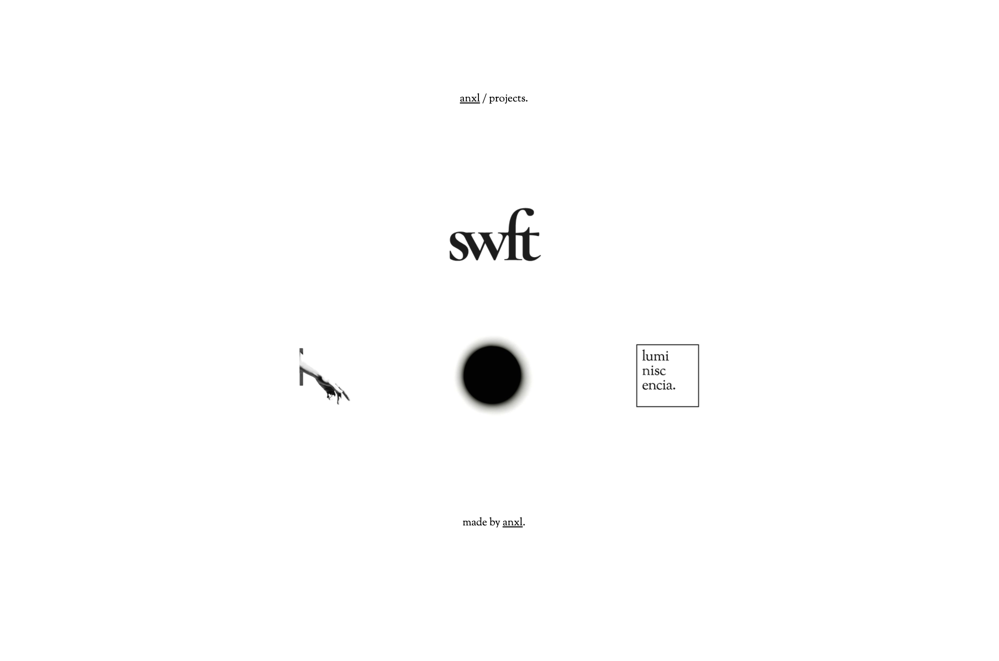

# Faith

Faith is a personal website/project with the objectives of both betterment in web design and personal marketing.

5.0 changed the jQuery into pure JS to make it smoother.

4.0 added some jQuery to make it flashier.

3.0 went back to old school HTML and CSS.

2.0 was developed in Metalsmith.

1.0 was made in PHP/HTML/SASS.

