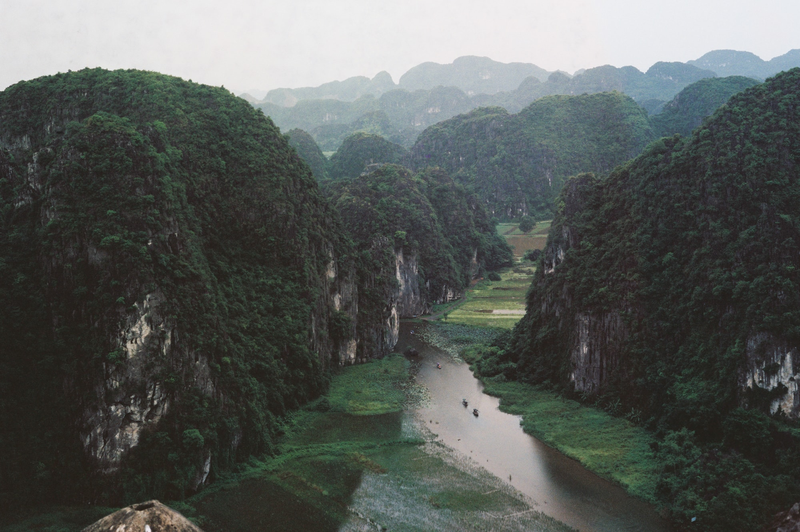
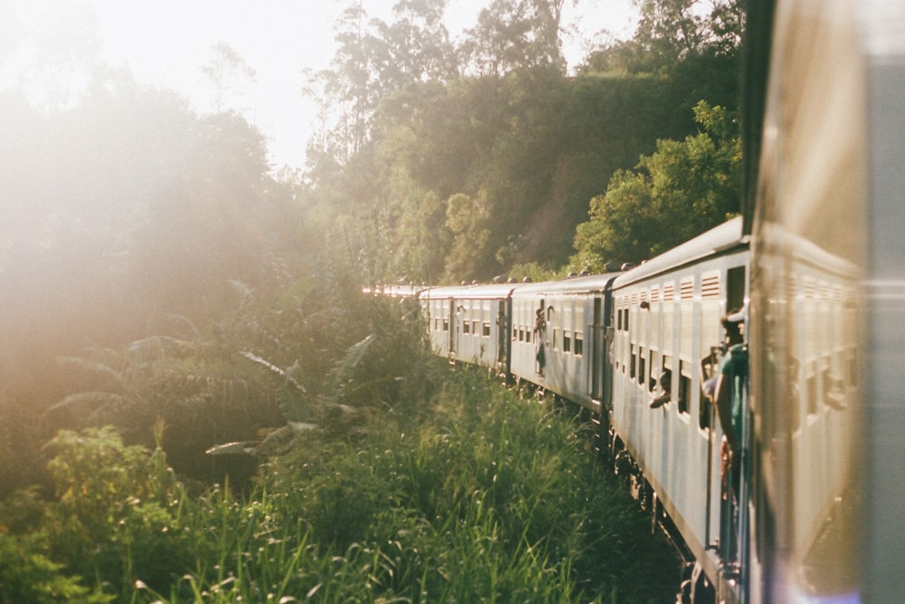
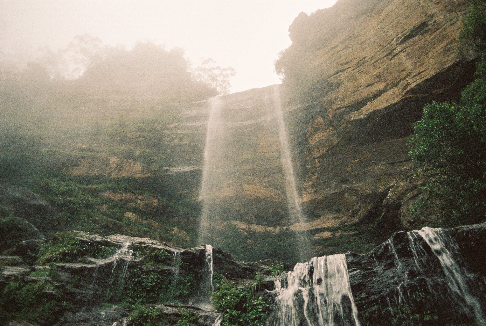
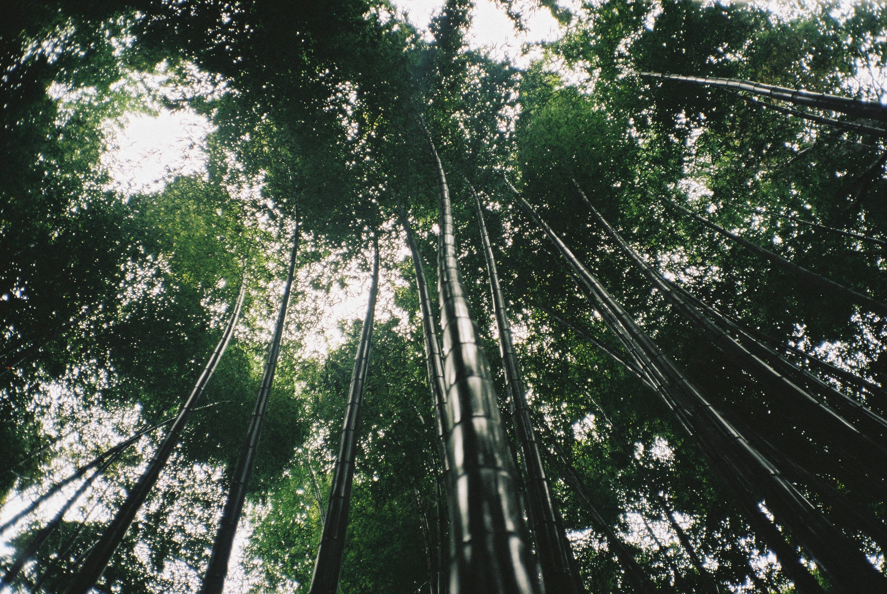

# Paths

[gabe scalise](http://www.gabescalise.com/)

I felt it, then. I felt a need, a kind of pressure, a deep down aching. I had to go – yet I had not done it, ever, never so, ever so far.

My body ached of ages. My heart was full of pride.

Yet something called me. I could feel it then – something mine was there. Something hidden. Something special. Something deeper, something strange – as in the sudden hours it wakened with strange eyes, looking me inside and peering into my depths without borders.

In these nights I could think of nothing else. I was devoured by these thoughts, these desires – these visions of places so far away, so unreachable, so impossible to grasp. And yet they called me, they did: these sights were had burned in my brain like flashes of light, like strange towers in the mist.

I could not escape them. I had to go. So I went.

At the beginning, it was so easy. I just followed those that went there: for they were plenty. They knew these places, had seen them somewhere – as I had. They had been enthused, as I had. They had been promised everything, had been regaled with the perspectives of glory and adventures. They were but fools. I was one too.

Many more were there, but they were others – they built the roads, and painted the idols. Those knew us, strangers: they'd peered inside us, cut our fingers, tasted our bones. They built our dreams now, and sucked us in: made our myths, and sucked our phantasies.

But there were paths that they would not go. Roads they wouldn't take. Before long, I had gone bored of them: always up,  always down, in  the same places, the same views. I craved the hidden. I craved the dark. So I ventured forth – expected them after me. I expected huntings, and stealth, and worries.

But nobody came.

So I got lost – and how to do it, how to explain what I felt then. How all things whispered. How all mists fell, and feelings cut, and how oppressive the shadows, and the lights, and the sounds. How short come all the words in that, how alone I was.

Yet I was not. Something was there, always – looming, pondering. You'd feel yourself unwanted there. You'd feel a stranger. I did too. I sensed the presences, the words, the laughter. I sensed their eyes upon me. They were just playing. They are still now.

I always thought of you. Have always done. I would have told you, everything: have shown you all, these dreams and conquers, these days alone, these steps too far, these tears of wisdom.

You were the one, always. I left you there, while I still owed you, after all the pleasures, and all the nights. For you, I would have come back. I would've. I would have done so, but I kept going. I could not stop. So I kept going.

And now my ways are gone. Somewhere down here, my will has broken. My paths have taken me, driven me here – and here I am, amongst these sights, these things impossible.

My dreams have become true. For now, I don't know ways forward. Nor any ways back. And now, the shadows come forth: their laughter clearer, still. Their wounds are painful.

Their tongues feel so...

[go back.](index.html)
