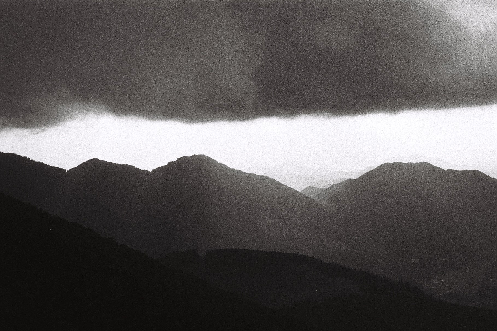
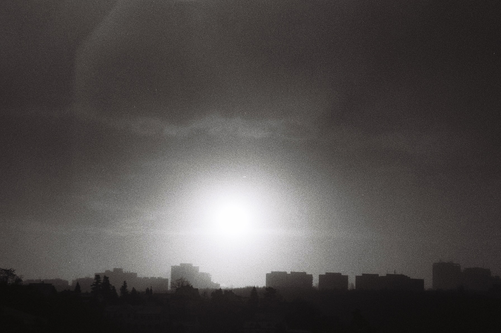

# Storms

[toffee maky](https://www.flickr.com/photos/toffee_maky)

Come hither, child, said she. And do not wonder – for all is brave, when all is done. She became ready – but wait, he said. I have a story. I have to ponder, he said, if thee want it told?

She was enthused, and curious. She wanted more. So tell thy story, she said, but make it quick, be sure in so – for night is calling, and lights go low.

Say why, then, thy paths are over, thy strength undone? I wonder: thy skies so closed, thy eyes so low?

I have been other, said he: I was not this, but different. I wandered then, was alive, was frowned by the current, and thrust upon. I watched it all, done it all – became cats, and noises, and sounds, and waterfalls. I went through every crevice, explored every hole.

Then I was younger, still, and also braver, still. I was not bent then, I was ready, had not been crossed then, had not been torn. But all rocks fought me, winds carved my bones. I was so different, then, than I become.

But how so happened, said she, how thee went numb? How this world broke thee, how life went so?

It was a man, said he, so proud and tall. He was in wholeness, so were his movements, his flamings, his smoke. It was his sunrise, his smiling, his touch. It became biggest – became my all.

His sides became my world, his fury storms. His sights my wordings, his shoulders pure ore. In all those days that followed, I followed him. I did not stop. I did not wonder, then, how I grew old. I just did so, in all those manners, without a stop.

But one day he was gone, he said, and was no more.

And who was this man -asked her, eager- that could be so? Who could have broke you, have you so done?

I did not know then, said he, I know now not. I never asked it. He never told. His name was nothing, his warmth was all. His life was endless, his line all round. His lights were spotless, his dark all gone.

He governed all times then – he drove them on. He announced all mornings, closed all evenings, and so on. His dawn was everything – still is so. Would you care, he said so, finally, a full smile on, to meet him now?

And then it happened: the sun then shone. She noticed then, how she'd been tricked. How all had gone. And thus she laughed, and quietly vanished.

And he – lived on.

[go back.](index.html)
