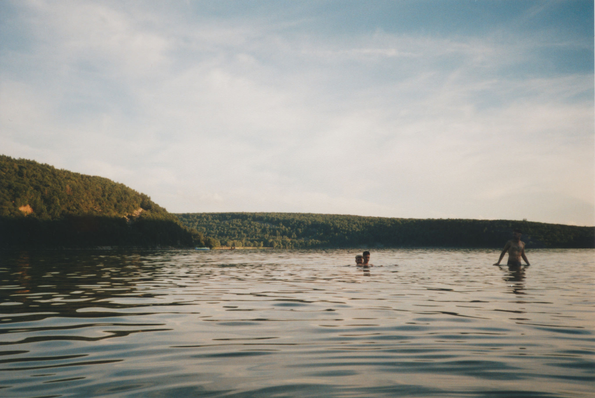
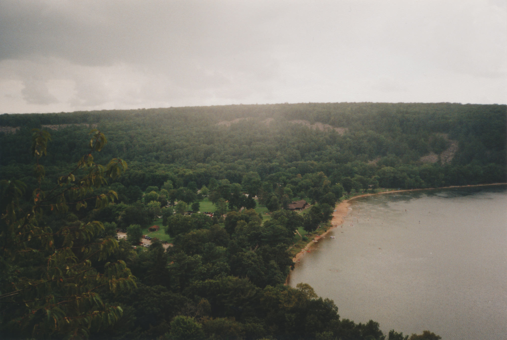

# Desires

[untitled - rachel levy.](https://www.flickr.com/photos/127269674@N04)

It is precisely this fact, of time flowing, and the impossibility of coming back, that makes views so enthusing.

The past runs away, always, as the future runs past us. Both are masochistic in nature: always out of reach, impenetrable. The moments that we live are already gone, in a process repeating, over and over.

Our dreams are all desires of elongation, and the capacity to keep, maintain our seconds, hold them down.

Just as nostalgia was initially meant to describe the desire to return in space -and not time-, the new nostalgias are consumed by the desire to be transported, or just to be, but in different ways.

In these views, we desire something else – we desire a better life, more cinematic, more unreal - but at the same time, more cohesive, more plot-like, more credible.

Because life itself is often unpredictable and even wrong, in many instances, but our thoughts follow order – the logic of the brain, at the very least.

And in that logic, which has been shaped by uncountable films, exist the idea and the promise that there is a simpler way, a simpler alternative, to not have to fight with the setbacks of existence.

For the wrinkles in life are ugly, and one too human, too corporeal to see and accept, and we too prideful.

And yet we are not alone in our rage against uncertainty, far from it – we experience it together, even colliding in our fury, compromising into viewpoints.

These visions are the colliding points, the points in which the machine breaks, and ideas come out in the open, and bloom into perspectives.

It is there, in the peering of fabricated realities, where we're not alone, anymore: for we experience alone together, as a single stroke, as a single viewpoint.

In these images, and in their sharing, and acceptance, we find connection -in tags, and #hashtags-, and come to terms with our phantasies of self.

Thus, a secret reveals, in opposition to our own beliefs: it's not that concrete that we seek, but the unreachable, the impossible, for in there we realise our desires.

Nevertheless, there's also danger. With time, our waves of rage can become tiles in our walls of perspective; a mosaic impenetrable, incredible, implacable.

The daily meditations and ramblings of fire can fade, slowly, into a suspended mediocrity. A noise in the trees. A constant reminder of the dreams set back.

Over time, we'll realise the loss: all those summers, and the lightnings, and the days of rain. We will miss those, as they passed, while we hunted in dreams – for yet the dreamed, and the glory, are still missing.

[go back.](index.html)
