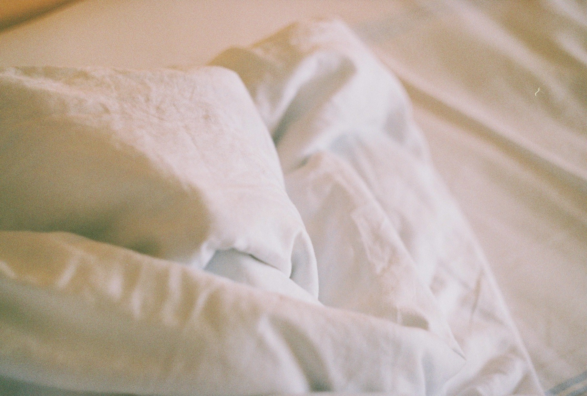
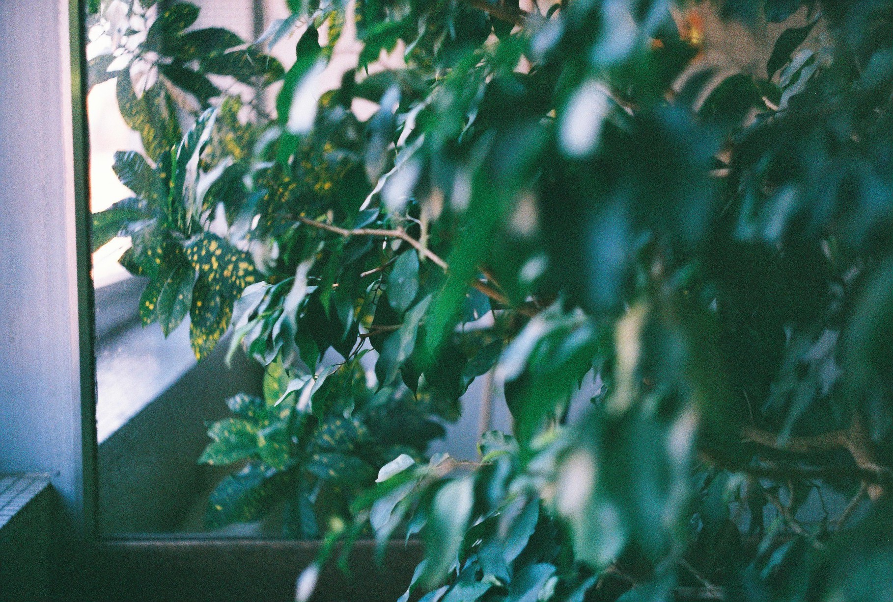
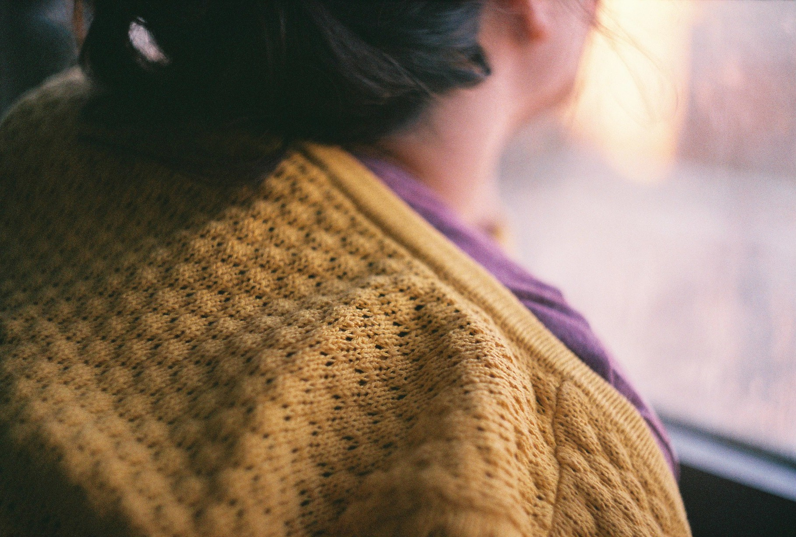

# Stories

[second home - romana klementis.](https://www.behance.net/gallery/60187151/Second-Home)

The feelings that arise from these views are sometimes as light as the feeling of light, or silence, or the immaculate view of the snow falling through the windows. In these moments, the sounds dying quietly, the space between the drops being eternal, unconquerable, invisible – they are so simple, and yet so many things are said.

All the stories hang there. All the memories, the fictions, the beholdings and belongings of the last days and the shared myths and myhtos, the powers that be and that drive us, the obsessions, the fallings, the trappings of the soul.

In these moments are revealed the secrets &ndash; the mixing of phrases, the connections of ends and beginnings, the lines becoming one. The ways are there, of becoming else, of lighting the shadows, of going empty, becoming filled, in all the incommensurable glory of the word. The stories are born.

Over time, they keep us alive. The stories. They keep us blundered, fill our waitings, stops decay and makes all white and powerful. And these fleeting points are stems, minds working at the birht of the things that please the spirit.

In that moments the colliding forces stop, the lines do end, the days go over, the lights remain, and not disappear, but come back. Our hands are made open to hope and our legs un-tightened to the facts of reality, to the wheels of the time that goes spinning.

In these moments we seem capable of understanding each other.

While the echoes continue, we wish them to keep going – and we wish on white, and stillness, and dreams kept beneath, guarded from sunbeams and protected from the beasts that roam.

But of course, that's not possible. The lights go breaking, the sound pierces, silence ends up breaking, days start, and words are relegated to paper and ink.

At least, for now.
